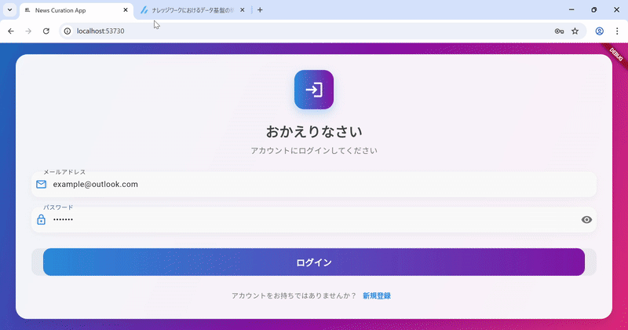

# News Curation App

自分用のニュース・記事キュレーションアプリです。バックエンドはPython (FastAPI)、フロントエンドはFlutter、データベースはpostgre、インフラはdockerで構築。

## 動作デモ


## 必要なもの

プロジェクトを実行するには、以下のツールがインストールされている必要があります。

- [Docker](https://www.docker.com/)
- [Flutter SDK](https://flutter.dev/docs/get-started/install)

## バックエンドのセットアップ

バックエンドはDockerコンテナ内で実行されます。

1. **Dockerイメージをビルドする:**

   プロジェクトのルートディレクトリで以下のコマンドを実行します。

   ```bash
   docker build -t newscuration-backend -f backend/Dockerfile backend
   ```

2. **Dockerコンテナを実行する:**

   ```bash
   docker run -d -p 8000:8000 newscuration-backend
   ```

3. **確認:**

   APIサーバーが `http://localhost:8000` で起動します。
   APIドキュメントは `http://localhost:8000/docs` で確認できます。

## フロントエンドのセットアップ

フロントエンドはFlutterで構築されています。

1. **フロントエンドのディレクトリに移動する:**

   ```bash
   cd frontend
   ```

2. **依存関係をインストールする:**

   ```bash
   flutter pub get
   ```

3. **アプリケーションを実行する (Web):**

   Chromeでアプリケーションを起動します。

   ```bash
   flutter run -d chrome
   ```

4. **アプリケーションを実行する (モバイル):**

   Androidエミュレータを起動するか、実機を接続してから以下のコマンドを実行します。

   ```bash
   flutter run
   ```
## アプリケーションの起動方法

1.  **バックエンドの起動:**
    プロジェクトのルートディレクトリ (`C:\dev\newsCuration`) で、以下のコマンドを実行します。
    ```bash
    docker compose up --build -d
    ```
    これにより、FastAPIサーバーとPostgreSQLデータベースがDockerコンテナとして起動します。

2.  **フロントエンドの起動:**
    `frontend` ディレクトリ (`C:\dev\newsCuration\frontend`) に移動し、以下のコマンドのいずれかを実行します。

    *   **Webブラウザで起動する場合:**
        ```bash
        flutter run -d chrome
        ```
    *   **Androidエミュレータや実機で起動する場合:**
        ```bash
        flutter run
        ```
        (事前にAndroidエミュレータを起動しておくか、USBデバッグが有効なAndroidデバイスを接続しておく必要があります。)

これで、アプリケーションが起動し、ログイン画面が表示されるはずです。
# NewsCuration